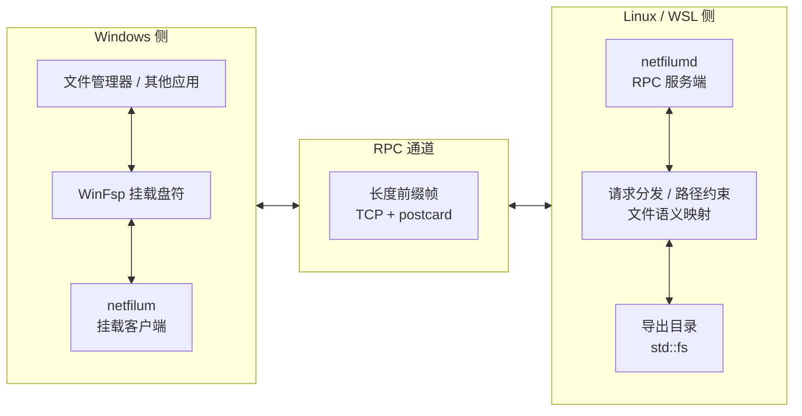

# netfilum

一个用于课程作业演示的 RPC 网络文件系统。

程序分为两端：

- `netfilum`：Windows 客户端，负责通过 WinFsp 挂载盘符
- `netfilumd`：Linux / WSL 服务端，负责导出一个目录并响应 RPC 请求

同机 Windows + WSL 场景可使用 `netfilum up` 快捷启动。它会通过 `wsl.exe` 启动与 `netfilum.exe` 同目录的 `netfilumd`，然后执行挂载。

## 架构



核心分工可以简单理解成这样：

- `netfilum` 和 `netfilumd` 之间的 RPC 协议、请求分发、路径约束、文件语义映射，是这个项目自己实现的
- WinFsp 负责把 Windows 用户态文件系统接到盘符上，让 `netfilum` 能作为一个可挂载盘工作
- `serde` 和 `postcard` 负责消息编解码，`clap` 负责命令行解析，`filetime` 负责时间戳设置
- 服务端真正落到磁盘上的文件操作，底层使用的是 Rust 标准库 `std::fs`

## 运行前提

- Windows 侧已安装 WinFsp
- 客户端能够连到服务端的地址和端口

默认地址是 `127.0.0.1:4040`，默认卷标是 `netfilum`。

## 从源码构建

如果需要从源码构建：

- Windows 侧需要 Rust 工具链，用于构建 `netfilum`
- Linux / WSL 侧需要 Rust 工具链，用于构建 `netfilumd`

Windows 客户端：

```bash
cargo build --release -p netfilum-client
```

Linux / WSL 服务端：

```bash
cargo build --release -p netfilum-server
```

构建产物统一输出到 `target/release/` 目录。从源码调试时也可以直接使用 `cargo run -p netfilum-client` 或 `cargo run -p netfilum-server`。

## 使用

先在 Linux / WSL 上启动服务端：

```bash
netfilumd --root /home/$USER/netfilum-root --addr 127.0.0.1:4040 --volume-label netfilum
```

再在 Windows 上挂载盘符：

```bash
netfilum mount --addr 127.0.0.1:4040 --mount N: --volume-label netfilum
```

如果服务端在另一台 Linux 机器上，把 `127.0.0.1:4040` 换成可达地址即可。

## 本机 WSL 快捷启动

同机 Windows + WSL 场景可以直接用：

```bash
netfilum up --distro Ubuntu --root /home/$USER/netfilum-root --mount N: --addr 127.0.0.1:4040
```

这条命令会：

1. 在指定的 WSL 发行版里启动与 `netfilum.exe` 同目录的 `netfilumd`
2. 等待 RPC 服务就绪
3. 在 Windows 上挂载盘符
4. 当前进程结束时卸载盘符并停止刚刚拉起的服务端

使用 `up` 时，需要把 Windows 客户端 `netfilum.exe` 和 Linux / WSL 服务端 `netfilumd` 放在同一个目录里，并且该目录能被 WSL 访问到。

## 说明

本项目实现的是自定义 RPC 文件系统，不兼容标准 NFS 协议。

本项目以课程作业演示为目标，默认假设：

- 单用户
- 单客户端挂载
- 无认证
- 无文件锁
- 无 symlink / hardlink / mmap
