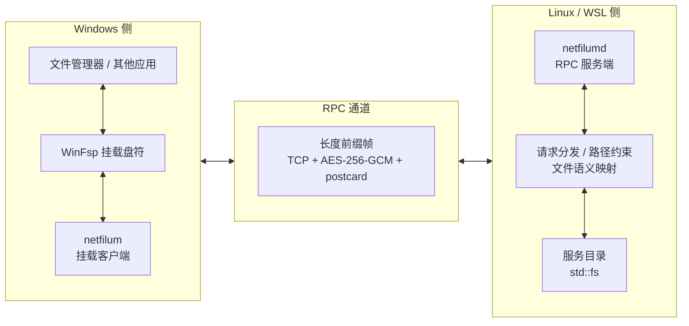

# netfilum

一个用于课程作业演示的 RPC 网络文件系统。

程序分为两端：

- `netfilum`：Windows 客户端，通过 WinFsp 挂载盘符
- `netfilumd`：Linux / WSL 服务端，将指定目录作为文件服务提供给客户端

`netfilum up` 会自动在 WSL 中启动与 `netfilum.exe` 同目录下的 `netfilumd`，然后完成挂载。

## 架构



核心分工：

- RPC 协议、请求分发、路径约束、文件语义映射由本项目实现
- WinFsp 将 Windows 用户态文件系统映射到盘符，让 `netfilum` 作为一个可挂载盘工作
- `serde`、`postcard`、`argon2`、`aes-gcm` 负责消息的编解码和传输加密，`clap` 负责命令行解析，`filetime` 负责时间戳设置
- 服务端的磁盘读写通过 Rust 标准库 `std::fs` 完成

## 运行前提

- Windows 侧已安装 [WinFsp](https://github.com/winfsp/winfsp)
- 客户端能连接到服务端的地址和端口
- 客户端与服务端使用同一个 `--password`

默认地址是 `127.0.0.1:4040`，默认卷标是 `netfilum`。

如果不传 `--password`，两端仍会启动，但会用空字符串派生密钥，只适合本机演示。

## 从源码构建

如果需要从源码构建：

- Windows 侧需要 Rust 工具链，用于构建 `netfilum`
- Linux / WSL 侧需要 Rust 工具链，用于构建 `netfilumd`

Windows 客户端：

```bash
cargo build --release -p netfilum-client
```

Linux / WSL 服务端：

```bash
cargo build --release -p netfilum-server
```

构建产物统一输出到 `target/release/` 目录。从源码调试时也可以直接使用 `cargo run -p netfilum-client` 或 `cargo run -p netfilum-server`。

## 使用

先在 Linux / WSL 上启动服务端：

```bash
netfilumd --root /home/$USER/netfilum-root --addr 127.0.0.1:4040 --volume-label netfilum --password secret
```

再在 Windows 上挂载盘符：

```bash
netfilum mount --addr 127.0.0.1:4040 --mount N: --volume-label netfilum --password secret
```

如果服务端在另一台机器上，把 `127.0.0.1:4040` 换成对应的地址即可。

## 一键启动（Windows + WSL）

如果服务端跑在本机 WSL 里，可以直接用：

```bash
netfilum up --distro Ubuntu --root /home/$USER/netfilum-root --mount N: --addr 127.0.0.1:4040 --password secret
```

这条命令会：

1. 在指定的 WSL 发行版里启动与 `netfilum.exe` 同目录下的 `netfilumd`
2. 等待服务就绪
3. 在 Windows 上挂载盘符
4. 进程结束时卸载盘符并停止服务端

使用 `up` 时，需要把 `netfilum.exe` 和 `netfilumd` 放在同一个目录里，并且该目录在 WSL 中可以访问。

## 说明

本项目实现的是自定义 RPC 文件系统，不兼容标准 NFS 协议。

本项目以课程作业演示为目标，默认假设：

- 单用户
- 单客户端挂载
- 传输加密只依赖共享口令，不进行身份认证
- 无文件锁
- 无 symlink / hardlink / mmap

我们使用了：<br>WinFsp - Windows File System Proxy, Copyright (C) Bill Zissimopoulos
